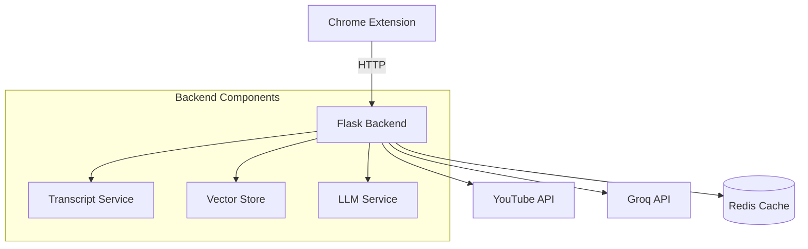

# YouTube AI Assistant Backend


A high-performance backend service powering the YouTube AI Assistant Chrome Extension.

---

## Features

### Core Capabilities
- **Video Transcript Processing**
- **AI-Powered Question Answering**
- **Video Summarization**
- **Conversation History**
- **Smart Caching**
- **Rate Limiting**

---

## Architecture


----

## Installation

**Clone repository**
```
git clone https://github.com/M-Awais-Hussain/YouTube-Chatbot-Extension.git
cd backend
```

**Create virtual environment**
```
python -m venv venv
source venv/bin/activate  # Windows: venv\Scripts\activate
```

**Install dependencies**
```
pip install -r requirements.txt
```

---

## Usage
### **Run Frontend**

- Open your Browser
- Click on triple dots in upper right corner
- Then click on Extensions > Manage Extension
- Click Developer mode in right most corner
- Click on **Load unpacked**
- Upload **extension** folder from source code

### **Run Backend**
```
python app.py
```

---

## 🐛 Troubleshooting
**Common Issues**
1. Missing API Key
    - Ensure .env contains GROQ_API_KEY
2. Rate Limits
    - Error 429 indicates rate limiting - adjust in config.py
3. Transcript Failures
    - Verify video has captions available

---

## 📜 License
Distributed under the MIT License. 

